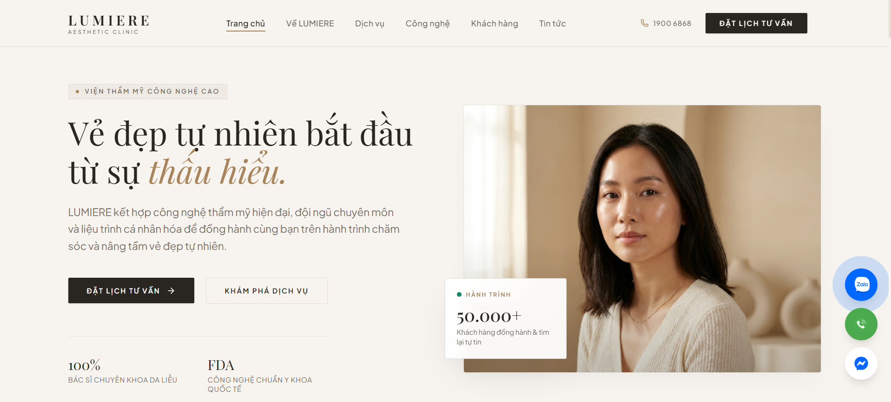

# ✨ LUMIERE AESTHETIC

**Landing page thẩm mỹ viện công nghệ cao xây dựng bằng React.**

## 🎨 Design Reference

**Figma Design:** [LUMIERE Aesthetic Design System](https://www.figma.com/design/RCyPuy9zo5xfh3Q7FHC43H/TH%E1%BA%A8M-M%E1%BB%B8-VI%E1%BB%86N-LUMIERE?node-id=0-1&t=Jknj7KZnl2kaTzXv-1)

## 🚀 Features

### 🌟 Core Functionalities

- **Single Page Landing:** Hero, giới thiệu, dịch vụ, công nghệ, kết quả, đánh giá và form đặt lịch trong một trang.
- **Consultation Booking:** Form đăng ký tư vấn, gửi thông tin về email của viện qua EmailJS.
- **Floating Contact:** Nút liên hệ nhanh Zalo, Hotline, Messenger (thanh cố định dưới cùng trên mobile).
- **Smooth Scroll:** Điều hướng mượt giữa các section.
- **Responsive:** Hiển thị tốt trên mobile, tablet và desktop.

## 🛠️ Tech Stack

- **Frontend**: React + TypeScript + Vite + Tailwind CSS
- **Icons**: lucide-react
- **Email Service**: EmailJS (nhận form đặt lịch)

## 🌐 Getting Started

### Prerequisites

- Node.js

### Installation

#### 1. Clone the repository

```bash
git clone <repository-url>
cd lumiere-aesthetic
```

#### 2. Configure Environment Variables

Create `.env` in the project root:

```env
VITE_EMAILJS_SERVICE_ID=your_service_id
VITE_EMAILJS_TEMPLATE_ID=your_template_id
VITE_EMAILJS_PUBLIC_KEY=your_public_key
```

#### 3. Setup Project

```bash
npm install
npm run dev
```

## 📸 Screenshots

### 1. Homepage



## 🤝 Contributing

Contributions are welcome! Feel free to fork and submit a pull request.

## 💌 Contact

- **Developer:** [ThanhDai2005](mailto:Dai2272005nv@gmail.com)
- **GitHub:** [GitHub Profile](https://github.com/ThanhDai2005)
